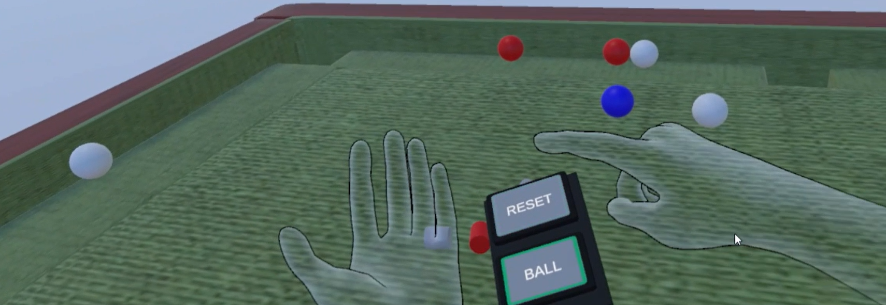

# UltraleapPoolGameDemo

   

## Project Description
The project consists of:
- download and install **Ultraleap** unity plugin;
- mount Leap sensor on **Oculus Meta Quest 2** headset;
- test official Ultraleap's demos
- develop our PoolGame demo

## Requirements
- **Ultraleap Gemini** hand-tracking software (V5.2+)
- Unity 2020.3 LTS or 2021.3 LTS
- Leap Motion Controller
- Oculus Meta Quest 2

## Set-up Ultraleap Unity Project 
The first step is to create a new 3D core project in Unity. Now you can follow these steps:
- Select **Edit > Project Settings** from Unity menu and select on the left panel **XR Plug-in Managment**. Install it and then check the **Oculus** box.
- Attach your Leap Controller to the Oculus Meta Quest 2.
- Turn on the headset and check if it is connected to the Oculus Client Software.
- Select **Window > Package Manager** from Unity menu and then select **Packages > Unity Registry**. Scroll down until **XR Plugin Management** and press **import**.
- Open again **Window > Package Manager** and click the **plus** button.
- Select **Add package from git URL** and paste this link **com.unity.xr.interaction.toolkit**.
- Download and Install [Ultraleap Gemini](https://developer.leapmotion.com/tracking-software-download)
- Download [Unity Modules packages](https://github.com/ultraleap/UnityPlugin/releases/)
- Select **Asset > Import Package > Custom Package** from the Unity menu.
- Import **Tracking.unitypackage**, **Tracking Preview.unitypackage**, **Tracking Examples.unitypackage** and **Tracking Preview Examples.unitypackage** that you just downloaded.

Now you can find Ultraleap official demos in **Assets > ThirdParty > Ultraleap > Tracking > Examples > XR-Examples**.

## Set-up UltraleapPoolGameDemo
In the previous step you created the Unity project and configure it to be used with Oculus and Ultraleap. Now you can download the code of this Git repo, copy the folders **Scenes**, **Materials**, **Prefabs** and **Scripts** and paste them into the **Assets** folder of the project.

# Demo
You can know open **PoolGame main** scene from the **Scenes** directory.

You will find a table with some balls and a text that explains to you the demo.

You can interact and play with some spheres and other little obstacles (cyliders) on the Pool Table. 

By looking at your left hand you can active a menu to either reset the scene or spawn new balls at random positions.

